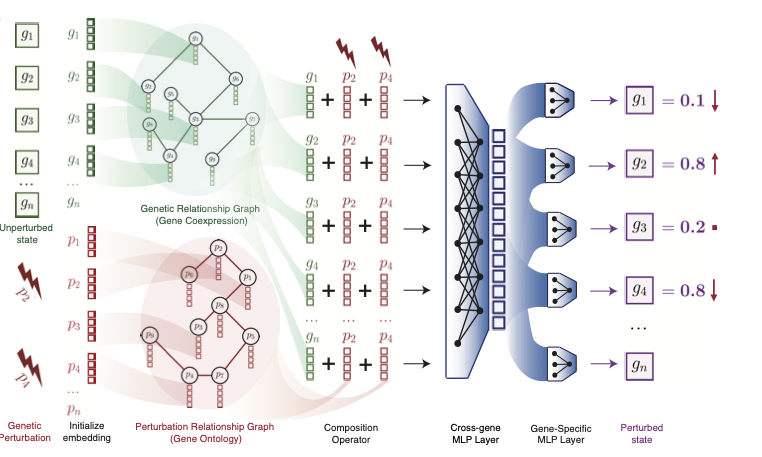

# GEARS: Predicting transcriptional outcomes of novel multi-gene perturbations

This repository hosts the official implementation of GEARS, a method that can predict transcriptional response to both single and multi-gene perturbations using single-cell RNA-sequencing data from perturbational screens. 


<p align="center"></p>


### Installation 

Install [PyG](https://pytorch-geometric.readthedocs.io/en/latest/notes/installation.html), and then do `pip install cell-gears`.

### Core API Interface

Using the API, you can (1) reproduce the result in our paper and (2) train your own GEARS model on your perturbation screen using a few lines of code.

```python
from gears import PertData, GEARS

# get data
pert_data = PertData('./data')
# load dataset in paper: norman, adamson, dixit.
pert_data.load(dataset = 'norman')
# specify data split
pert_data.prepare_split(split = 'simulation', seed = 1)
# get dataloader with batch size
pert_data.get_dataloader(batch_size = 32, test_batch_size = 128)

# set up and train a model
gears_model = GEARS(pert_data, device = 'cuda:8')
gears_model.model_initialize(hidden_size = 64)
gears_model.train(epochs = 20)

# save/load model
gears_model.save_model('gears')
gears_model.load_pretrained('gears')

# predict
gears_model.predict([['FOX1A', 'AHR'], ['FEV']])
gears_model.GI_predict([['FOX1A', 'AHR'], ['FEV', 'AHR']])
```

To use your own dataset, create a scanpy adata variable with a `gene_name` column in `adata.var`, and two columns `condition`, `cell_type` in `adata.obs`. Then run:

```python
pert_data.new_data_process(dataset_name = 'XXX', adata = adata)
# to load the processed data
pert_data.load(data_path = './data/XXX')
```

### Demos

| Name | Description |
|-----------------|-------------|
| [Dataset Tutorial](demo/data_tutorial.ipynb) | Tutorial on how to use the dataset loader and read customized data|
| [Model Tutorial](demo/model_tutorial.ipynb) | Tutorial on how to use the GEARS model to train a predictor |
| [Plot top 20 DE genes](demo/tutorial_plot_top20_DE.ipynb) | Tutorial on how to plot the top 20 DE genes|
| [Uncertainty](demo/tutorial_uncertainty.ipynb) | Tutorial on how to train an uncertainty-aware GEARS model |

### Cite Us

```

```